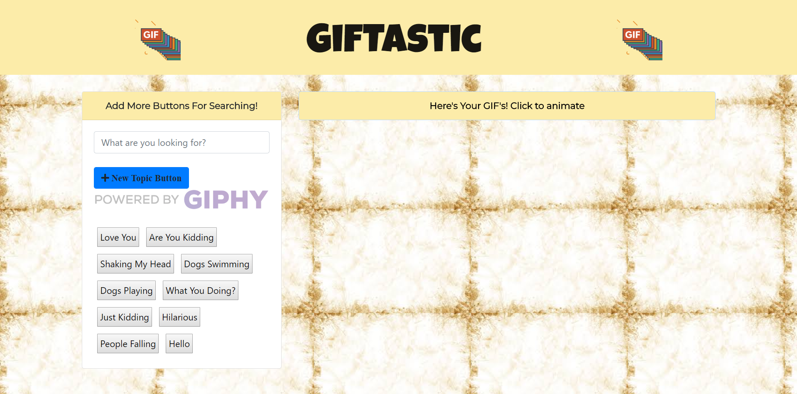

# GifTastic

### This was an assignment for UCF coding bootcamp designed to demonstrate an ability to use the Giphy API.

## Screenshot

## Technologies Used
* HTML
* CSS
* BootStrap
* JavaScript
* jQuery
* Giphy API
* Font Awesome
* Google Fonts

## Try my APP
https://minneolamike.github.io/GifTastic/